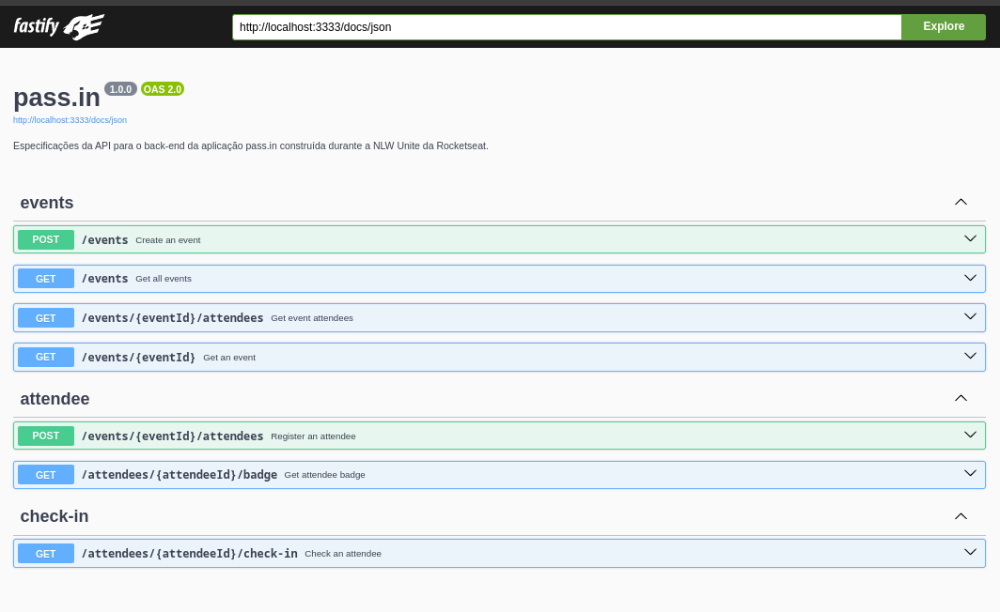
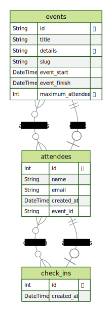

<div align="center" id="top">
  

  &#xa0;

</div>

<h1 align="center">Nlw 15 Api Pass In</h1>

<p align="center">
  

  

  

  

</p>

<hr> -->

  [Sobre](#dart-sobre) &#xa0; | &#xa0;
  [Funcionalidades](#sparkles-funcionalidades) &#xa0; | &#xa0;
  [Tecnologias](#rocket-tecnologias) &#xa0; | &#xa0;
  [Requisitos](#white_check_mark-requisitos) &#xa0; | &#xa0;
  [Iniciando](#checkered_flag-iniciando) &#xa0; | &#xa0;
  [Documentation](#api-documentation) &#xa0; | &#xa0;
  [Licença](#memo-licença) &#xa0; | &#xa0;
  <a href="https://github.com/andrelinos" target="_blank">Autor</a>

&#xa0;

## :dart: Sobre ##

Descrição do projeto

## :sparkles: Funcionalidades ##

- [x] O organizador deve poder cadastrar um novo evento;
- [x] O organizador deve poder visualizar dados de um evento;
- [x] O organizador deve poser visualizar a lista de participantes;
- [x] O participante deve poder se inscrever em um evento;
- [x] O participante deve poder visualizar seu crachá de inscrição;
- [x] O participante deve poder realizar check-in no evento;

Regras de negócio

- [x]  O participante só pode se inscrever em um evento uma única vez;
- [x] O participante só pode se inscrever em eventos com vagas disponíveis;
- [x] O participante só pode realizar check-in em um evento uma única vez;

Requisitos não-funcionais

- [x]  O check-in no evento será realizado através de um QRCode;

## :rocket: Tecnologias ##

Abaixo a lista das principais tecnologias utilizadas

- [Fastify](https://fastify.dev/)
- [Node.js](https://nodejs.org/en/)
- [Prisma](https://www.prisma.io/)
- [TypeScript](https://www.typescriptlang.org/)
- [tsup](https://github.com/egoist/tsup)
- [Zod](https://zod.dev/)
- [Fastify-type-provider-zod](https://www.npmjs.com/package/fastify-type-provider-zod)
- [Swagger](https://swagger.io/)
- [Fastify-swagger-ui](https://github.com/Weslley049/fastify-swagger-ui)
- [Fastify-Cors](https://github.com/Weslley049/fastify-cors)

## :white_check_mark: Requisitos ##

Para iniciar o projeto :checkered_flag:, você precisa ter
[Git](https://git-scm.com) e [Node](https://nodejs.org/en/)
instalados em seu sistema operacional.

## :checkered_flag: Iniciando ##

- **Clonando o projeto**

```bash
git clone https://github.com/andrelinos/nlw-15-api-pass-in
```

- **Acesse a pasta do projeto**

```bash
cd nlw-15-api-pass-in
```

- **Instale as dependências**

```bash
pnpm i
```

- **Configure um container do docker para ter o banco de dados Postgres**

```bash
docker compose up --build -d
```

- **Execute as migrations**

```bash
npm run prisma migrate dev
```

- **Adicione dados de exemplo**

```bash
npm run prisma db seed
```

- **Execute seu projeto**

```bash
npm run start

# The server will initialize in the <http://localhost:3333>

```

<div align="center">

**Schema do banco de dados**
  

  &#xa0;

</div>

# Documentação da API pass.in

Especificações da API para o back-end da aplicação pass.in construída durante a NLW Unite da Rocketseat.

## Versão da API

1.0.0

## Eventos

### Criar um Evento

Cria um novo evento.

- **URL**
  `/events`

- **Método**
  `POST`

- **Parâmetros do Corpo da Requisição**
    - `title` (string, mínimo de 4 caracteres) - O título do evento.
    - `details` (string, opcional) - Detalhes adicionais sobre o evento.
    - `eventStart` (string, formato de data e hora) - Data e hora de início do evento.
    - `eventFinish` (string, formato de data e hora) - Data e hora de término do evento.
    - `maximumAttendees` (integer, opcional) - O número máximo de participantes permitidos no evento.

- **Resposta de Sucesso**
    - Código: `201`
    - Corpo:

    ```json
    {
      "eventId": "string (formato UUID)"
    }
    ```

### Obter todos os Eventos

Obtém todos os eventos ou filtra eventos com base em uma consulta opcional.

- **URL**
  `/events`

- **Método**
  `GET`

- **Parâmetros da Consulta**
    - `query` (string, opcional) - Consulta para filtrar eventos por título.
    - `pageIndex` (string, opcional, padrão: `'0'`) - Índice da página para paginação.
    - `perPage` (string, opcional, padrão: `'10'`) - Número de eventos por página.

- **Resposta de Sucesso**
    - Código: `200`
    - Corpo:

    ```json
    {
      "events": [
        {
          "id": "string (formato UUID)",
          "title": "string",
          "slug": "string",
          "details": "string (opcional)",
          "eventStart": "string (formato data e hora)",
          "eventFinish": "string (formato data e hora)",
          "maximumAttendees": "integer (opcional)",
          "attendeesAmount": "integer",
          "attendees": [
            {
              "id": "integer",
              "name": "string",
              "email": "string",
              "createdAt": "string (formato data e hora)",
              "checkedInAt": "string (formato data e hora, opcional)"
            }
          ]
        }
      ]
    }
    ```

### Obter um Evento

Obtém um evento específico com base no ID fornecido.

- **URL**
  `/events/{eventId}`

- **Método**
  `GET`

- **Parâmetros da URL**
    - `eventId` (string, formato de UUID) - O ID único do evento.

- **Resposta de Sucesso**
    - Código: `200`
    - Corpo:

    ```json
    {
      "event": {
        "id": "string (formato UUID)",
        "title": "string",
        "slug": "string",
        "details": "string (opcional)",
        "eventStart": "string (formato data e hora)",
        "eventFinish": "string (formato data e hora)",
        "maximumAttendees": "integer (opcional)",
        "attendeesAmount": "integer"
      }
    }
    ```

### Atualizar um Evento

Atualiza um evento existente com base no ID fornecido.

- **URL**
  `/events/{eventId}`

- **Método**
  `PUT`

- **Parâmetros da URL**
    - `eventId` (string, formato de UUID) - O ID único do evento a ser atualizado.

- **Parâmetros do Corpo da Requisição**
    - `title` (string, mínimo de 4 caracteres) - O título atualizado do evento.
    - `details` (string, opcional) - Detalhes atualizados sobre o evento.
    - `eventStart` (string, formato de data e hora) - Data e hora de início atualizadas do evento.
    - `eventFinish` (string, formato de data e hora) - Data e hora de término atualizadas do evento.
    - `maximumAttendees` (integer, opcional) - O número máximo atualizado de participantes permitidos no evento.

- **Resposta de Sucesso**
    - Código: `200`

### Excluir um Evento

Exclui um evento existente com base no ID fornecido.

- **URL**
  `/events/{eventId}`

- **Método**
  `DELETE`

- **Parâmetros da URL**
    - `eventId` (string, formato de UUID) - O ID único do evento a ser excluído.

- **Resposta de Sucesso**
    - Código: `200`

## Participantes (Attendees)

### Registrar um Participante

Registra um novo participante para um evento específico.

- **URL**
  `/events/{eventId}/attendees`

- **Método**
  `POST`

- **Parâmetros do Corpo da Requisição**
    - `name` (string, mínimo de 4 caracteres) - O nome do participante.
    - `email` (string, formato de email) - O endereço de email do participante.

- **Parâmetros da URL**
    - `eventId` (string, formato de UUID) - O ID único do evento.

- **Resposta de Sucesso**
    - Código: `201`
    - Corpo:

    ```json
    {
      "attendeeId": "integer"
    }
    ```

### Obter Participantes de um Evento

Obtém todos os participantes de um evento específico.

- **URL**
  `/events/{eventId}/attendees`

- **Método**
  `GET`

- **Parâmetros da Consulta**
    - `query` (string, opcional) - Consulta para filtrar participantes por nome.
    - `pageIndex` (string, opcional, padrão: `'0'`) - Índice da página para paginação.
    - `perPage` (string, opcional, padrão: `'10'`) - Número de participantes por página.

- **Parâmetros da URL**
    - `eventId` (string, formato de UUID) - O ID único do evento.

- **Resposta de Sucesso**
    - Código: `200`
    - Corpo:

    ```json
    {
      "attendees": [
        {
          "id": "integer",
          "name": "string",
          "email": "string",
          "createdAt": "string (formato data e hora)",
          "checkedInAt": "string (formato data e hora, opcional)"
        }
      ]
    }
    ```

### Obter um Participante

Obtém informações sobre um participante específico com base no ID fornecido.

- **URL**
  `/attendees/{attendeeId}`

- **Método**
  `GET`

- **Parâmetros da URL**
    - `attendeeId` (integer) - O ID único do participante.

- **Resposta de Sucesso**
    - Código: `200`
    - Corpo:

    ```json
    {
      "attendee": {
        "id": "integer",
        "name": "string",
        "email": "string",
        "createdAt": "string (formato data e hora)",
        "checkedInAt": "string (formato data e hora, opcional)"
      }
    }
    ```

### Marcar Check-in de um Participante

Marca o check-in de um participante em um evento.

- **URL**
  `/attendees/{attendeeId}/check-in`

- **Método**
  `GET`

- **Parâmetros da URL**
    - `attendeeId` (integer) - O ID único do participante.

- **Resposta de Sucesso**
    - Código: `201`

## :memo: Licença ##

“Este projeto está sob a licença do MIT. Para mais detalhes, veja o arquivo [LICENSE](LICENSE.md)”

Feito com :heart: por [Andrelino Silva](https://github.com/andrelinos)
</a>

&#xa0;

[Voltar ao topo](#top)
