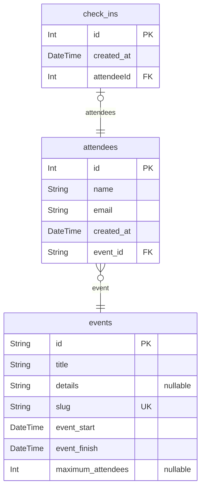

# NLW Pass-in
> Generated by [`prisma-markdown`](https://github.com/samchon/prisma-markdown)

- [default](#default)

## default

### `events`

**Properties**
  - `id`: 
  - `title`: 
  - `details`: 
  - `slug`: 
  - `event_start`: 
  - `event_finish`: 
  - `maximum_attendees`: 

### `attendees`

**Properties**
  - `id`: 
  - `name`: 
  - `email`: 
  - `created_at`: 
  - `event_id`: 

### `check_ins`

**Properties**
  - `id`: 
  - `created_at`: 
  - `attendeeId`: 